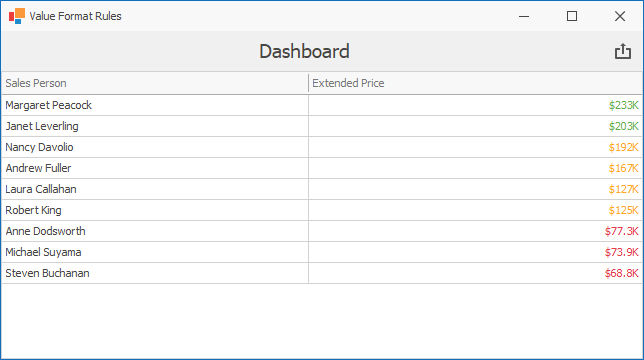
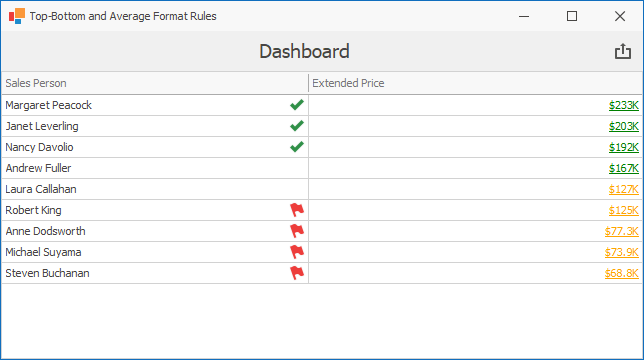
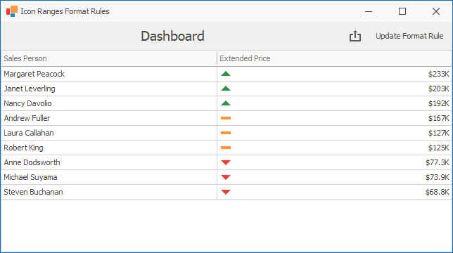
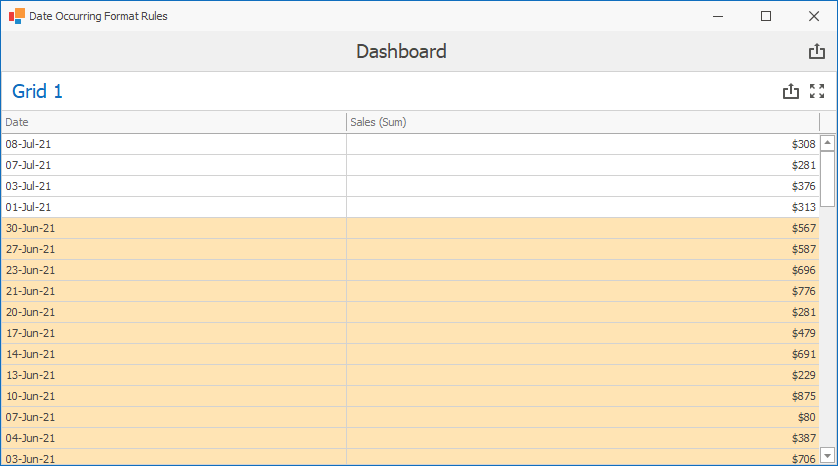
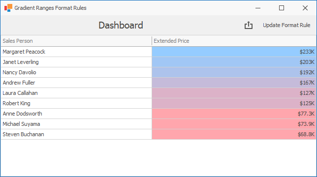
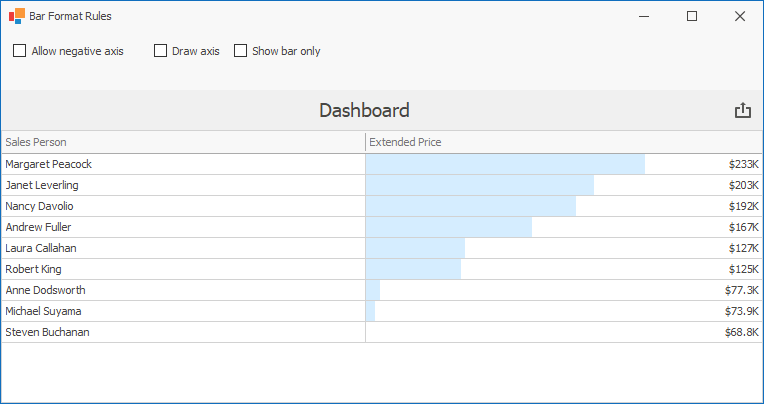
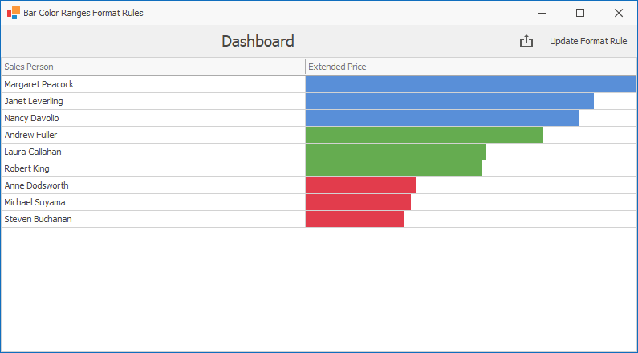
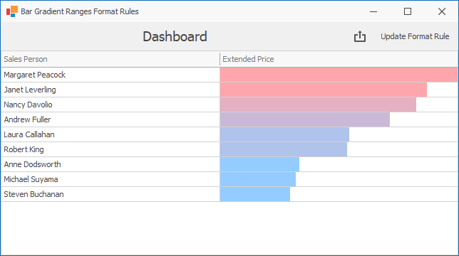

<!-- default badges list -->

<!-- default badges end -->

# Dashboard for WinForms - How to Apply Conditional Formatting to Grid Cells

The following example shows how to apply conditional formatting to Grid cells. 

<!-- default file list -->
## Files to Look At

* [ValueConditionForm.cs](./CS/Dashboard_ConditionalFormatting_Grid/ValueConditionForm.cs) (VB: [ValueConditionForm.vb](./VB/Dashboard_ConditionalFormatting_Grid/ValueConditionForm.vb))
* [TopAverageConditionForm.cs](./CS/Dashboard_ConditionalFormatting_Grid/TopAverageConditionForm.cs) (VB: [TopAverageConditionForm.vb](./VB/Dashboard_ConditionalFormatting_Grid/TopAverageConditionForm.vb))
* [IconRangeConditionForm.cs](./CS/Dashboard_ConditionalFormatting_Grid/IconRangeConditionForm.cs) (VB: [IconRangeConditionForm.vb](./VB/Dashboard_ConditionalFormatting_Grid/IconRangeConditionForm.vb))
* [DateOccurringForm.cs](./CS/Dashboard_ConditionalFormatting_Grid/DateOccurringForm.cs) (VB: [DateOccurringForm.vb](./VB/Dashboard_ConditionalFormatting_Grid/DateOccurringForm.vb))
* [GradientRangeConditionForm.cs](./CS/Dashboard_ConditionalFormatting_Grid/GradientRangeConditionForm.cs) (VB: [GradientRangeConditionForm.vb](./VB/Dashboard_ConditionalFormatting_Grid/GradientRangeConditionForm.vb))
* [BarConditionForm.cs](./CS/Dashboard_ConditionalFormatting_Grid/BarConditionForm.cs) (VB: [BarConditionForm.vb](./VB/Dashboard_ConditionalFormatting_Grid/BarConditionForm.vb))
* [RangeColorBarConditionForm.cs](./CS/Dashboard_ConditionalFormatting_Grid/RangeColorBarConditionForm.cs) (VB: [RangeColorBarConditionForm.vb](./VB/Dashboard_ConditionalFormatting_Grid/RangeColorBarConditionForm.vb))
* [RangeGradientBarConditionForm.cs](./CS/Dashboard_ConditionalFormatting_Grid/RangeGradientBarConditionForm.cs) (VB: [RangeGradientBarConditionForm.vb](./VB/Dashboard_ConditionalFormatting_Grid/RangeGradientBarConditionForm.vb))
<!-- default file list end -->

## Examples Structure

When you launch the example, you see the start form that allows you to invoke a form for the selected format rule. Select the rule and click **Show** to view how the format rule applies.

### Value

**View File:** [ValueConditionForm.cs](./CS/Dashboard_ConditionalFormatting_Grid/ValueConditionForm.cs) (VB: [ValueConditionForm.vb](./VB/Dashboard_ConditionalFormatting_Grid/ValueConditionForm.vb))

The **Value** format rule allows you to compare dimension/measure values with predefined static values. 

The [FormatConditionValue](https://docs.devexpress.com/Dashboard/DevExpress.DashboardCommon.FormatConditionValue) class contains this format rule's settings.

This form shows how to apply conditional formatting settings to Grid cells whose values are greater than, less than or between the specified values.

### Top-Bottom and Average

**View File:** [TopAverageConditionForm.cs](./CS/Dashboard_ConditionalFormatting_Grid/TopAverageConditionForm.cs) (VB: [TopAverageConditionForm.vb](./VB/Dashboard_ConditionalFormatting_Grid/TopAverageConditionForm.vb))

The **Top-Bottom** format rule allows you to highlight a specific number of topmost/bottommost values. This form shows how to apply conditional formatting to the specified number of top/bottom values. The number of values can be specified as an absolute value or a percentage of all values.

The [FormatConditionTopBottom](https://docs.devexpress.com/Dashboard/DevExpress.DashboardCommon.FormatConditionTopBottom) class contains this format rule's settings.

The **Average** format rule allows you to highlight values above or below an average value.

The [FormatConditionAverage](https://docs.devexpress.com/Dashboard/DevExpress.DashboardCommon.FormatConditionAverage) class contains this format rule's settings.

### Icon Ranges

**View File:** [IconRangeConditionForm.cs](./CS/Dashboard_ConditionalFormatting_Grid/IconRangeConditionForm.cs) (VB: [IconRangeConditionForm.vb](./VB/Dashboard_ConditionalFormatting_Grid/IconRangeConditionForm.vb))

The **Icon Ranges** format rule displays a specific icon based on a value range. You can select a predefined set of icons or apply a specific icon to each range.

The [FormatConditionRangeSet](https://docs.devexpress.com/Dashboard/DevExpress.DashboardCommon.FormatConditionRangeSet) class contains this format rule's settings.

Click the **Update Format Rule** button to change the number of ranges, specify new range boundaries and customize icons related to existing ranges.

### Date Occurring

**View File:** [DateOccurringForm.cs](./CS/Dashboard_ConditionalFormatting_Grid/DateOccurringForm.cs) (VB: [DateOccurringForm.vb](./VB/Dashboard_ConditionalFormatting_Grid/DateOccurringForm.vb))

The **Date Occurring** format rule allows you to apply formatting to date-time values of a specific date and/or date interval relative to the current date.

The [FormatConditionDateOccurring](https://docs.devexpress.com/Dashboard/DevExpress.DashboardCommon.FormatConditionDateOccurring) class contains this format rule's settings.

This form demonstrates how to apply conditional formatting to Grid cells whose values fall into one of the predefined intervals.

### Range Gradient

**View File:** [GradientRangeConditionForm.cs](./CS/Dashboard_ConditionalFormatting_Grid/GradientRangeConditionForm.cs) (VB: [GradientRangeConditionForm.vb](./VB/Dashboard_ConditionalFormatting_Grid/GradientRangeConditionForm.vb))

The **Range Gradient** format rule allows you to use predefined color gradients to apply conditional formatting to different ranges of values.

The [FormatConditionRangeGradient](https://docs.devexpress.com/Dashboard/DevExpress.DashboardCommon.FormatConditionRangeGradient) class contains this format rule's settings.

This form shows how to apply the predefined Red-Blue color gradient. Click the **Update Format Rule** button to change start/end colors and the number of ranges in the color gradient. The third color in the middle of the color scale is also specified to generate a 3-color gradient.

### Bar

**View File:** [BarConditionForm.cs](./CS/Dashboard_ConditionalFormatting_Grid/BarConditionForm.cs) (VB: [BarConditionForm.vb](./VB/Dashboard_ConditionalFormatting_Grid/BarConditionForm.vb))

The **Bar** format rule allows you to visualize numeric values using bars.

The [FormatConditionBar](https://docs.devexpress.com/Dashboard/DevExpress.DashboardCommon.FormatConditionBar) class contains this format rule's settings.

This form shows how to display data bars within grid cells. Note that bars corresponding to positive and negative values are colored differently.

### Bar Color Ranges

**View File:** [RangeColorBarConditionForm.cs](./CS/Dashboard_ConditionalFormatting_Grid/RangeColorBarConditionForm.cs) (VB: [RangeColorBarConditionForm.vb](./VB/Dashboard_ConditionalFormatting_Grid/RangeColorBarConditionForm.vb))

The **Bar Color Ranges** format rule allows you to visualize numeric values using bars whose colors are contained in the specified color set.

The [FormatConditionColorRangeBar](https://docs.devexpress.com/Dashboard/DevExpress.DashboardCommon.FormatConditionColorRangeBar) class contains this format rule's settings.

This form shows how to display colored bars within Grid cells. Click the **Update Format Rule** button to change the number of ranges, specify new range boundaries and change colors mapped to ranges.

### Bar Gradient Ranges

**View File:** [RangeGradientBarConditionForm.cs](./CS/Dashboard_ConditionalFormatting_Grid/RangeGradientBarConditionForm.cs) (VB: [RangeGradientBarConditionForm.vb](./VB/Dashboard_ConditionalFormatting_Grid/RangeGradientBarConditionForm.vb))

The **Bar Gradient Ranges** format rule allows you to visualize numeric values using bars whose colors are contained in the specified color gradient.

The [FormatConditionGradientRangeBar](https://docs.devexpress.com/Dashboard/DevExpress.DashboardCommon.FormatConditionGradientRangeBar) class contains this format rule's settings.

This example shows how to apply conditional formatting to Grid cells using the predefined Red-Blue color gradient. Click the **Update Format Rule** button to change start/end colors and the number of ranges in the color gradient. The third color in the middle of the color scale is also specified to generate a 3-color gradient.

## Documentation

* [Conditional Formatting](https://docs.devexpress.com/Dashboard/116914/common-features/appearance-customization/conditional-formatting)
* [Grid - Conditional Formatting](https://docs.devexpress.com/Dashboard/401933/winforms-dashboard/winforms-designer/create-dashboards-in-the-winforms-designer/dashboard-item-settings/grid/conditional-formatting)

## More Examples

* [How to Apply Conditional Formatting to Pivot Cells](https://github.com/DevExpress-Examples/how-to-apply-conditional-formatting-to-pivot-cells-t267344)
* [How to Apply Conditional Formatting to the Card Dashboard Item](https://github.com/DevExpress-Examples/how-to-apply-conditional-formatting-to-the-card-dashboard-item)
* [How to Apply Conditional Formatting to the Chart Dashboard Item](https://github.com/DevExpress-Examples/WinForms-Dashboard-How-to-Apply-Conditional-Formatting-to-the-Chart-Dashboard-Item)
* [How to Highlight Data in a Scatter Chart Dashboard Item](https://github.com/DevExpress-Examples/WinForms-Dashboard-How-to-Highlight-Data-in-the-Scatter-Chart-Dashboard-Item)
